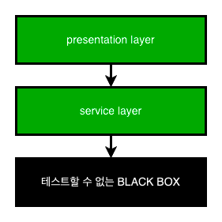
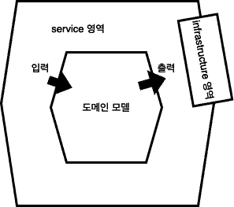

기능을 구현하다 보면, DB, redis, 외부 서비스와 같은 외부 의존성을 어떻게 테스트해야 할지 난감한 경우가 많습니다. 

만약 DB에 제대로 된 멤버 정보를 insert 하는지 테스트하려면 어떻게 해야할까요? kafka에 제대로 된 메세지가 전달되는지는 어떻게 알 수 있을까요?
한 가지 방법을 생각해 본다면, 직접 테스트를 위한 서버를 구축하여 테스트를 진행할 수 있을 것입니다. 
하지만 db, redis, kafka 등 테스트를 위해서 구축해야 할 것들이 많다면 테스트의 유지보수 비용은 계속해서 늘어날 수밖에 없습니다. 
그래서 외부 의존성은 테스트하기 어렵습니다.

이번 글에서는 테스트 하기 어려운 외부 의존성을 어떻게 테스트해야 할지에 다루어 보려고 합니다.

## 테스트하기 힘든 부분 최소화 

테스트하기 힘든 부분은 BLACK BOX 영역이라고 칭하겠습니다. 이 BLACK BOX 영역에는 대부분의 외부 의존성들이 들어갑니다. 따라서 mysql, redis, kafak, 외부 서비스 등등이 BLACK BOX 영역에 포함됩니다.  
하지만 위에서 말씀 드렸듯이 외부 의존성은 테스트하기 어렵습니다. BLACK BOX 영역으로 인해 직/간접적으로 해당 영역에 의존하고 있는 모든 영역들이 테스트하기 어려워집니다. 

BLACK BOX에 의존하고 있는 presentation layer, service layer는 BLACK BOX 영역으로 전이됩니다. 이렇게 전이되다 보면 모든 영역이 테스트 불가능한 BLACK BOX 영역이 됩니다. 
그래서 BLACK BOX 영역이 전이되지 않게 격리해야 합니다. 즉 BLACK BOX 영역을 테스트하지 못하더라도 다른 객체는 여전히 테스트를 진행할 수 있는 환경을 구성해야 합니다. 

이를 위해서는 두가지 방법이 있다고 생각합니다. 
- 테스트하기 쉬운 코드를 최대한 많이 만들기 
- Mock을 이용한 외부 의존성 격리 

위의 두 가지 방법에 초점을 맞춰서 설명하겠습니다. 

## 테스트하기 쉬운 코드를 최대한 많이 만들기

위에서도 설명 드렸듯이 외부 의존성이 있다면 테스트를 하기 어렵습니다. 그렇기에 테스트하기 쉬운 로직과 테스트하기 어려운 외부 의존성을 분리해야 합니다. 
그렇다면 테스트하기 쉬운 코드는 어떤 코드일까요?

외부 의존성과 분리된 코드는 테스트 하기 쉬운 코드로 변경됩니다. 즉 외부 의존성이 제거된 함수는 내부에 숨은 입출력이 제거되었기 주어진 입력에 대해 항상 동일한 출력을 생성합니다. 이런 함수는 순수 함수라고 불립니다. 

아래는 핵사고날 아키텍처의 대략적인 구조입니다. 

핵사고날 아키텍처에서는 모든 비즈니스 로직을 도메인 모델에서 처리합니다. 그리고 service 영역에서 도메인 모델에 의해 출력된 결과값을 infrastructure 영역에 제공하여 외부 의존성에 전달합니다. 
즉 도메인 모델은 어떠한 외부 의존성을 지니고 있지 않습니다. 도메인 모델은 단지 입력값을 기반으로 복잡한 비즈니스로직을 처리하고 결과값을 반환합니다. 
그리고 service 영역은 도메인 모델에 의해 나온 결과값을 출력받아서 infrastructure 영역에 전달하는 역할을 담당합니다. 

이처럼 핵사고날 아키텍처는 외부 의존성을 비즈니스 연산 끝으로 몰아서 비즈니스 로직을 외부 의존성과 분리합니다. 비즈니스 로직은 순수함수 형태로 어떠한 의존성을 갖지 않기 때문에 테스트 코드를 작성하기 쉬운 형태로 관리됩니다. 

## Mock을 이용한 테스트 대상 코드 격리 

BLACK BOX 영역을 직/간접적으로 의존하고 있는 모든 계층은 테스트하기 어렵다고 말씀드렸습니다. 이런 경우 외부 의존성을 Mocking 해서 테스트 대상이 되는 코드를 격리할 수 있습니다. 
격리되면 BLACK BOX 영역을 의존하는 영역들이 테스트 하기 어렵거나, 불가능한 영역으로 전이되는 것을 막을 수 있습니다. 

### Mock Server 기반 Test Code
구현 코드가 변경됐으니 테스트 코드도 변경이 필요합니다. 

