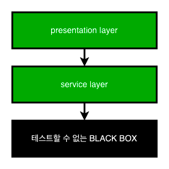
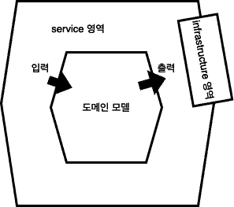
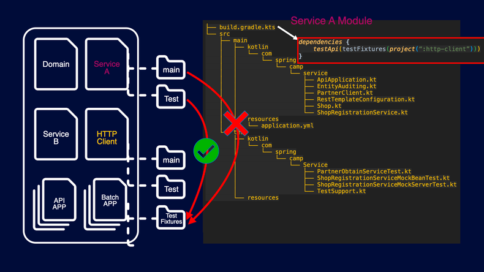

기능을 구현하다 보면, DB, redis, 외부 서비스와 같은 외부 의존성을 어떻게 테스트해야 할지 난감한 경우가 많습니다. 

만약 DB에 제대로 된 멤버 정보를 insert 하는지 테스트하려면 어떻게 해야할까요? kafka에 제대로 된 메세지가 전달되는지는 어떻게 알 수 있을까요?
한 가지 방법을 생각해 본다면, 직접 테스트를 위한 서버를 구축하여 테스트를 진행할 수 있을 것입니다. 
하지만 db, redis, kafka 등 테스트를 위해서 구축해야 할 것들이 많다면 테스트의 유지보수 비용은 계속해서 늘어날 수밖에 없습니다. 
그래서 외부 의존성은 테스트하기 어렵습니다.

이번 글에서는 외부 의존성과 연관지어 테스트하기 어렵거나, 불가능한 코드를 어떻게 테스트할지에 대해 이야기해보고자 합니다. 

## 테스트하기 힘든 부분 최소화 

테스트하기 힘든 부분은 BLACK BOX 영역이라고 칭하겠습니다. 이 BLACK BOX 영역에는 대부분의 외부 의존성들이 들어갑니다. 따라서 mysql, redis, kafak, 외부 서비스 등등이 BLACK BOX 영역에 포함됩니다.  
하지만 위에서 말씀 드렸듯이 외부 의존성은 테스트하기 어렵습니다. BLACK BOX 영역으로 인해 직/간접적으로 해당 영역에 의존하고 있는 모든 영역들이 테스트하기 어려워집니다. 



BLACK BOX에 의존하고 있는 presentation layer, service layer는 BLACK BOX 영역으로 전이됩니다. 이렇게 전이되다 보면 모든 영역이 테스트가 어려 BLACK BOX 영역이 됩니다. 
그래서 BLACK BOX 영역이 전이되지 않게 격리해야 합니다. 즉 BLACK BOX 영역을 테스트하지 못하더라도 다른 객체는 여전히 테스트를 진행할 수 있는 환경을 구성해야 합니다. 

이를 위해서는 두가지 방법이 있다고 생각합니다. 
- 테스트하기 쉬운 코드와 테스트하기 어려운 코드 분리 
- Mock을 이용한 외부 의존성 격리 

위의 두 가지 방법에 초점을 맞춰서 설명하겠습니다. 

## 테스트하기 쉬운 코드와 테스트하기 어려운 코드 분리

위에서도 설명 드렸듯이 외부 의존성이 있다면 테스트를 하기 어렵습니다. 그렇기에 테스트하기 쉬운 로직과 테스트하기 어려운 외부 의존성을 분리해야 합니다. 
그렇다면 테스트하기 쉬운 코드는 어떤 코드일까요?

외부 의존성과 분리된 코드는 테스트 하기 쉬운 코드로 변경됩니다. 즉 외부 의존성이 제거된 함수는 내부에 숨은 입출력이 제거되었기 주어진 입력에 대해 항상 동일한 출력을 생성합니다. 이런 함수는 순수 함수라고 불립니다. 

아래는 핵사고날 아키텍처의 대략적인 구조입니다. 



핵사고날 아키텍처에서는 모든 비즈니스 로직을 도메인 모델에서 처리합니다. 그리고 service 영역에서 도메인 모델에 의해 출력된 결과값을 infrastructure 영역에 제공하여 외부 의존성에 전달합니다. 
즉 도메인 모델은 어떠한 외부 의존성을 지니고 있지 않습니다. 도메인 모델은 단지 입력값을 기반으로 복잡한 비즈니스로직을 처리하고 결과값을 반환합니다. 
그리고 service 영역은 도메인 모델에 의해 나온 결과값을 출력받아서 infrastructure 영역에 전달하는 역할을 담당합니다. 

이처럼 핵사고날 아키텍처는 외부 의존성을 비즈니스 연산 끝으로 몰아서 비즈니스 로직을 외부 의존성과 분리합니다. 비즈니스 로직은 순수함수 형태로 어떠한 의존성을 갖지 않기 때문에 테스트 코드를 작성하기 쉬운 형태로 관리됩니다. 

## Mock을 이용한 외부 의존성 격리

BLACK BOX 영역을 직/간접적으로 의존하고 있는 모든 계층은 테스트하기 어렵다고 말씀드렸습니다. 이런 경우 외부 의존성을 Mocking 해서 테스트 대상이 되는 코드를 격리할 수 있습니다. 
격리되면 BLACK BOX 영역을 의존하는 영역들이 테스트 하기 어렵거나, 불가능한 영역으로 전이되는 것을 막을 수 있습니다. 테스트를 위한 외부 의존성(db, redis, kafka 등등)이 준비되지 않아도 테스트를 진행할 수 있습니다. 

### Mock Server 기반 Test Code

만약 Mock Server를 이용하여 격리된 환경을 구축한다면 아래와 같은 코드가 들어가야 할 것입니다. 

```java
@Test
public void test() {
	// given 
    mockServer.stubFor(
            WireMock.post(WireMock.urlPathMatching("/api/demo/(.*?)"))
                .withRequestBody(WireMock.equalToJson("{\"name\":  \"john\"}"))
                .willReturn(
                    WireMock.aResponse()
                        .withStatus(200)
                        .withHeader("Content-Type", MediaTypes.APPLICATION_JSON)
                        .withBody("{\"message\": \"Hi, john\"}")
                )
        );	
	
	// when
    ...     
}
```
mockServer에 요청 url, request body, http status, response body, header 등을 설정해줍니다. 이렇게 Mock Server를 이용해서 http를 Mocking하면 실제 환경과 가장 근접한 테스트를 할 수 있습니다.  
하지만 문제는 역설적으로 많은 기능을 제공하기 때문에 발생합니다. 많은 것을 확인하고, 설정할 수 있지만 그만큼 Mock Server를 설정하기 위해 더 많은 시간과 노력이 들어갑니다.  
1~2개 정도만 외부에 의존한다면 Mock Server를 이용해도 괜찮을 것입니다. 하지만 외부에 의존하는 기능들이 계속 많아진다면?, 기능이 계속 복잡해질 가능성이 있다면? 다양한 상황들로 인해 Mock Server를 이용한 테스트는 개발 생산성의 저하로 이어질 수 있습니다.

### @MockBean

http를 Mocking 하는 것 보다는, 행위를 Mocking 한다면 과도한 Mocking을 방지할 수 있습니다. 방법은 ```@MockBean```을 사용하는 것입니다. ```@MockBean```으로 Mock 객체를 주입받고 행위 자체를 Mocking 한다면 더욱 쉽게 테스트를 작성할 수 있습니다.

```java
@MockBean
private MemberClient memberClient;

@Test
void makePost() throws Exception {

    // given
    PostCreateRequest request = new PostCreateRequest("title", "content");

    when(memberClient.checkMember(anyLong())).thenReturn(ResponseEntity.ok(new MemberCheckResponse(true)));

    // when
    ResultActions result = mockMvc.perform(post("/post/v1/post")
            .contentType(MediaType.APPLICATION_JSON)
            .content(objectMapper.writeValueAsString(request)));

    // then
    result.andExpect(status().is2xxSuccessful());
}
```
위 코드에서 memberClient를 ```@MockBean```으로 주입받습니다. 그리고 준비 단계에서 memberClient를 Mocking 합니다. 코드만 보면 알 수 있듯이 Mock Server로 http를 Mocking 했을 때 보다 훨씬 코드가 간결합니다. 
이처럼 행위를 Mocking 하는 것이 더 쉽습니다. 하지만 문제가 하나 있습니다. ```@MockBean```을 사용하면 Spring Context가 재시작을 합니다. ```@MockBean```을 사용하면 Spring Context가 재정의 되여 Spring Context를 재사용하지 못하기 때문입니다. 
이 문제가 계속 방치된다면 ```@MockBean```이 늘어날 때마다 Spring Context 초기화가 추가되기 때문에 점전 테스트 수행 속도는 느려질 수밖에 없습니다. 

### @TestConfiguration 사용 

```@MockBean```이 늘어날 때마다 Spring Context가 재시작 되는 문제를 방지하기 위해 ```@TestConfiguration```을 이용했습니다. 이렇게 ```@TestConfiguration```으로 테스트에서 필요한 빈을 미리 띄워놓기 때문에 Spring Context가 재시작하지 않습니다. 

```java
@TestConfiguration
public class MemberClientConfig {

	@Bean("memberClient")
	public MemberClient memberClient() {
		return mock(MemberClient.class);
	}
}
```

통합 테스트 클래스에서 상속 받는 추상클래스에 아래와 같이 추가해줍니다. 
```java
@Import({MemberClientConfig.class})
@SpringBootTest
@Transactional
@AutoConfigureMockMvc
public abstract class BaseControllerTest {

	@Autowired
	protected MockMvc mockMvc;

	@Autowired
	protected ObjectMapper objectMapper;
}
```

그리고 테스트 작성시에는 ```@Autowired```로 빈 주입을 받아서 사용합니다. 

```java
class ControllerTest extends BaseControllerTest {

	@Autowired
	@Qualifier("memberClient")
	private MemberClient memberClient;
	
	@Test
	void makePost() throws Exception {

		// given
		PostCreateRequest request = new PostCreateRequest("title", "content");

		when(memberClient.checkMember(anyLong())).thenReturn(ResponseEntity.ok(new MemberCheckResponse(true)));

		// when
		ResultActions result = mockMvc.perform(post("/post/v1/post/me")
				.contentType(MediaType.APPLICATION_JSON)
				.content(objectMapper.writeValueAsString(request)));

		// then
		result.andExpect(status().is2xxSuccessful());
		
        ...
	}
```

위에서 작성했던 Mock Server를 이용하는 방식보다 훨씬 간단하게 Mocking을 할 수 있게 되었습니다. 
다만, 한가지 문제가 남았습니다. ```@TestConfiguration```으로 memberClient를 빈등록해주는 MemberClientConfig 클래스는 어디에 만들어주어야 할까요? 
해답은 [이전글](https://wooktech.tistory.com/104)에 나와있습니다.

ServiceA 모듈이 member-http-client 모듈에 의존한다고 가정하겠습니다. 

```java
// ServiceA의 build.gradle
bootJar.enabled = true
jar.enabled = false

group = 'com.example.serviceA'
version = '1.0.0'

dependencies {
    implementation project(":member-http-client")

    // 다른 의존성들 
}
```

memberClient는 ServiceA의 관심사가 아닙니다. 따라서 ```@TestConfiguration```으로 memberClient를 등록하는 코드는 member-http-client 모듈에 들어가야 합니다. 
memberClient가 member-http-client 모듈에 들어가 있어야 응집도있는 코드가 됩니다. 하지만 문제는 ServiceA 모듈의 테스트에서는 member-http-client의 테스트를 import 할 수 없다는 것입니다. 



여기서 필요한 것이 'java-test-fixtures' 플러그인입니다. 
java-test-fixtures를 이용하면 ServiceA 테스트에서 member-http-client의 testFixtures 파일의 클래스를 import할 수 있습니다. 

물론 memberClient를 빈으로 등록하는 코드가 member-http-client의 main 디렉터리에 있으면 ServiceA의 테스트에서도 import할 수는 있습니다. 
하지만 문제가 있습니다. 테스트를 위한 Mock 객체임에도 main 디렉터리에서 접근이 가능하다는 것은 매우 큰 문제라고 생각합니다. 테스트 만을 위한 코드가 계속해서 운영 코드의 범주를 침범한다면 애플리케이션에는 악영향을 끼칠 수 밖에 없습니다. 만약 운영 로직에서 테스트를 위한 mock 객체에 접근한다면 큰 장애가 발생할 수도 있습니다. 
그래서 테스트 코드와 운영 코드를 명확하게 분리하는 것은 분명 큰 가치가 있다고 생각합니다. 

## 정리

이번 글을 통해서 테스트하기 어렵거나, 불가능한 코드를 어떻게 테스트할 것인지에 대해 이야기해보았습니다. 
첫번째 방법은 코드에서 테스트하기 어려운 코드를 분리해서 테스트하기 쉬운 코드를 최대한 많이 확보하는 것이었습니다. 그래서 도메인 로직에서 외부 의존성을 분리해서 도메인 로직을 쉽게 테스트할 수 있었습니다. 
두번째 방법은 외부 의존성이 아직 구축되지 않은 상황에서 테스트가 불가능한 코드를 Mock Server 또는 Mock을 이용해서 테스트하는 방법에 대해 생각해보았습니다. 
Mock Server는 http를 Mocking하여 실제 환경과 가장 유사한 테스트 방식이지만, 개발 생산성이 저하되는 단점이 있었습니다. Mock은 행위를 Mocking 하기 때문에 Mock Server에 비해 비교적 간단하게 Mocking할 수 있었습니다. 
