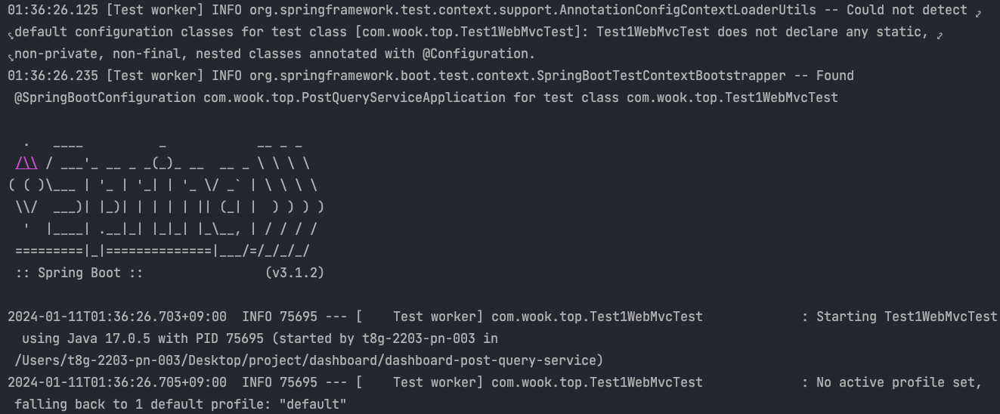
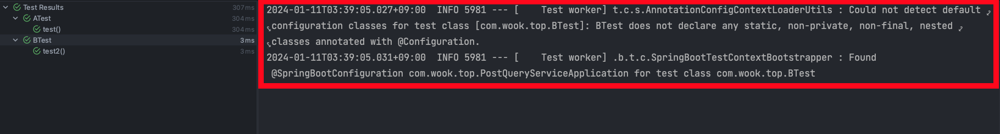

테스트 코드를 작성하다 보면, 처음에는 문제가 없었지만 프로젝트가 커지면서 테스트 코드의 성능이 느려지는 문제를 겪곤 합니다.  저 또한 회사에서 테스트 코드를 작성하면서 테스크 코드가 점점 늘어남에 따라 테스트 속도가 느려지는 경험을 많이 했습니다. 

보통 테스트 코드를 작성하다 보면, Spring 어플리케이션에서 검증이 필요한 빈들을 가져오기 위해 Spring Context를 띄웁니다. 그런데 이렇게 테스트 클래스 마다 Spring Context를 띄운다면 어떻게 될까요? Spring Context는 방대한 설정 정보를 가지고 있기 때문에 굉장히 무거운 객체이고 테스트 클래스 마다 이 무거운 객체를 생성한다면 테스트의 성능이 느려질 수 밖에 없을 것입니다. 
그래서 spring에서는 Spring Context를 재사용할 수 있도록 캐싱을 합니다. 이를 Context Caching이라고 합니다. 

## **Context Caching?**
그렇다면 테스트에서 어떻게 Spring Context를 캐싱할까요? 스프링에서는 Context Parameter를 가지고 캐시키를 생성합니다. 
공식 문서에 나와 있는 Context Parameter는 아래와 같습니다. 
- locations (from @ContextConfiguration)
- classes (from @ContextConfiguration)
- contextInitializerClasses (from @ContextConfiguration)
- contextCustomizers (from ContextCustomizerFactory) – this includes @DynamicPropertySource methods as well as various features from Spring Boot’s testing support such as @MockBean and @SpyBean.
- contextLoader (from @ContextConfiguration)
- parent (from @ContextHierarchy)
- activeProfiles (from @ActiveProfiles)
- propertySourceDescriptors (from @TestPropertySource)
- propertySourceProperties (from @TestPropertySource)
- resourceBasePath (from @WebAppConfiguration)

만약 아래와 같은 코드에서는 locations의 정보를 이용해 Context Parameter를 만들게 됩니다. 
```java
@ContextConfiguration(locations="applicationContext.xml")
```
```@SpringBootTest```는 내부적으로 ```@ContextConfiguration```으로 구현되어 있기 때문에 아래의 코드의 classes 정보도 Context Parameter를 만들기 위해 사용됩니다. 
```java
@SpringBootTest(classes="applicationContext.xml")
```
많이 사용되는 ```@MockBean```, ```@SpyBean```도 Context Parameter 생성을 위해 사용됩니다. 


## **Spring Context를 캐싱 하지 못하는 경우**
위의 예시에서 보았듯이 Spring test에서는 다양한 정보들을 이용해서 Context Parameter를 만듭니다. 모든 테스트 클래스가 같은 Context Parameter를 만들어서 사용한다면 하나의 Spring Context를 이용하게 되고, 재생성할 필요도 없을 것입니다. 

하지만 만약 Context Parameter가 달라진다면 Spring Context를 캐싱하지 못하고 Spring Context를 다시 만듭니다. 아래는 Spring Context를 캐싱하지 못하고 재생성 했을 때 발생하는 테스트 코드 콘솔화면입니다. 


대부분의 테스트 클래스에서는 검증하고자 하는 대상이 다릅니다. 테스트 대상이 다르기 때문에 필요한 bean 오브젝트도 다를 것입니다. 그러면 모든 테스트 클래스 마다 Spring Context를 띄워야 할까요? 이미 다 알고 계시듯이 모든 테스트 클래스에서 새로운 Spring Context를 띄운다면, 테스트 성능은 테스트 케이스가 추가될 때마다 느려질 것입니다. 

Spring Context를 매 테스트 마다 띄우지 않도록 Context Caching 하기 위해서는 Context Parameter를 일치시켜야 합니다. 

## **Context Caching 적극적으로 사용하기**
만약 아래와 같은 두개의 테스트 클래스가 있다면, 테스트에 필요한 의존성은 두개의 클래스가 ```JwtAuthorizationFilter```, ```JwtTokenProvider```로 같은데 테스트 대상이 다르다는 이유로 Spring Context를 캐싱하지 못합니다. 
```java
@WebMvcTest({
    AController.class
})
@Import({JwtAuthorizationFilter.class, JwtTokenProvider.class})
public class ATest {

	@Autowired
	protected MockMvc mockMvc;

	@Test
	void test() throws Exception {
		mockMvc.perform(get("/a/v1")
				.contentType(MediaType.APPLICATION_JSON)
				.content(""));
	}
}

@WebMvcTest({
    BController.class
})
@Import({JwtAuthorizationFilter.class, JwtTokenProvider.class})
public class BTest {

	@Autowired
	protected MockMvc mockMvc;

	@Test
	void test() throws Exception {
		mockMvc.perform(get("/b/v1")
				.contentType(MediaType.APPLICATION_JSON)
		);
	}
}
```
실제로도 테스트 전체 실행을 하면, Spring Context를 두 번 실행합니다. 불필요하게 Spring Context가 재생성 되는 것을 막기 위해서는 두개의 클래스가 같은 Context Parameter를 가지도록 수정할 필요가 있습니다. 두 개의 클래스가 같은 부모 클래스를 상속한다면 같은 Context Parameter를 가지도록 할 수 있습니다. 상속을 받은 테스트 클래스는 동일한 부모 클래스의 설정을 가져오기 때문입니다. 

그래서 아래와 같은 부모 클래스를 만들어 보았습니다. 
```java
@WebMvcTest({
	AController.class,
	BController.class
})
@Import({JwtAuthorizationFilter.class, JwtTokenProvider.class})
public abstract class BaseMvcTest {

    @Autowired
	protected MockMvc mockMvc;
}
```
해당 부모 클래스를 두 클래스에 모두 상속한다면 두 개의 클래스는 모두 같은 Spring Parameter를 가지게 됩니다. 
```java
public class ATest extends BaseMvcTest {

	@Test
	void test() throws Exception {
		mockMvc.perform(get("/a/v1")
				.contentType(MediaType.APPLICATION_JSON)
		);
	}
}

public class BTest extends BaseMvcTest {

	@Test
	void test() throws Exception {
		mockMvc.perform(get("/b/v1")
				.contentType(MediaType.APPLICATION_JSON)
		);
	}
}
```
실제로 테스트를 실행해보면 첫번째 테스트 클래스는 Spring Context를 띄우지만, 두번째 테스트 클래스는 Spring Context를 띄우지 않는 것을 확인할 수 있습니다. 


## **마무리**
Spring 테스트 성능을 최적화 하는 방법을 알아보았습니다. 테스트 성능은 초기 프로젝트에서는 문제가 되지 않겠지만, 프로젝트가 점점 커지면서 크게 다가오는 문제라고 생각합니다. 테스트 성능은 개발 생산성과도 직결되어 있기 때문입니다. 그래서 테스트 클래스를 만들 때마다 기존에 캐싱되어 있는 Spring Context를 재사용 하는 것이 중요하다고 생각합니다. 

### Reference
https://docs.spring.io/spring-framework/reference/testing/testcontext-framework/ctx-management/caching.html