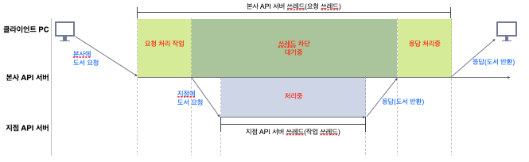
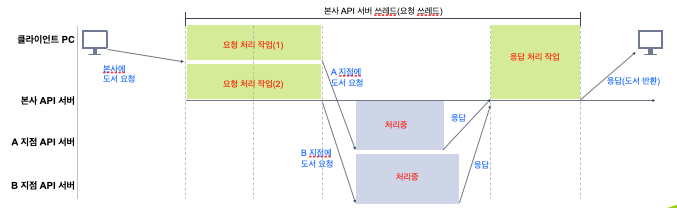

이번 포스팅에선 Webflux가 무엇이고, 어떤 철학을 가지고 있는지에 대해서 알아보고자 합니다. 

## 리액티브 프로그래밍? 
리액티브 프로그래밍은 데이터가 변경되거나 이벤트가 발생할 때 자동으로 반응하는 방식으로 비동기 스트림을 처리하는 프로그래밍 방식입니다.

자바에서는 리액티브 스트림즈라는 리액티브 프로그래밍을 표준화한 명세를 제공합니다. 
주요 인터페이스는 아래와 같습니다. 
- Publisher
- Subscriber
- Subscription
- Processor

그리고 이를 구현한 구현체로는 RxJava, Java 9 Flow Api, Akka Streams, Reactor 등이 있습니다. 
특히 이번 포스팅에서 주로 다뤄볼 Spring Webflux는 스프링에서 구현한 구현체인 ```Reactor```를 사용합니다. 

## Blocking I/O vs None Blocking I/O
본격적으로 Spring Webflux로 넘어가기 전에 먼저 Blocking I/O와 none Blocking I/O에 대해 알아보고자 합니다. 

### Blocking I/O
기존의 전통적인 Blocking I/O 방식은 요청 하나 당 쓰레드를 생성합니다. 따라서 요청이 많아지면 당연히 필요한 쓰레드 개수도 증가합니다. 
이는 트래픽이 증가하는 환경에서 메모리 사용이 증가하고, 컨텍스트 스위칭 비용이 많아짐을 의미합니다. 

그리고 Blocking I/O 방식에서는 작업 쓰레드가 종료될 때까지 요청 쓰레드는 차단됩니다. 


Blocking I/O의 특성상 아래와 같은 문제가 발생할 수 있습니다. 
- 대용량 트래픽 환경에서 메모리 사용에 오버헤드가 발생할 수 있습니다.
- 쓰레드풀의 쓰레드에 지연이 발생하면, 유휴 쓰레드가 고갈되면서 지연이 발생할 수 있습니다.


#### Blocking I/O 어떤 경우에 사용할까?
- 낮은 수준의 동시성이 필요한 경우 
- 저장소가 블로킹 방식만 지원 
- 학습 비용을 최소화하고 유지보수가 쉬운 구조가 필요할 경우 


### Non-Blocking I/O
Non-Blocking I/O 방식은 요청당 쓰레드를 생성하지 않습니다. 대신 하나의 쓰레드로 대량의 요청을 처리합니다. 적은 수의 쓰레드를 사용하기 때문에 대용량 트래픽 환경에서도 CPU와 메모리를 효율적으로 사용합니다.

그리고 Blocking I/O 방식과 달리 작업쓰레드가 작업중이어도, 요청 쓰레드가 차단되지 않습니다. 


Non-Blocking I/O 방식에서도 주의할 점이 있습니다. 
- CPU를 많이 사용하는 복잡한 계산을 요청할 경우 다른 요청들의 작업이 차단될 수 있다. 
- 요청에서 응답까지 Fully Non-Blocking 방식이어야 진정한 효과를 발휘한다. 

#### Non-Blocking I/O 어떤 경우에 사용할까?
- 낮은 수준의 동시성이 필요한 경우
- 저장소가 블로킹 방식만 지원
- 학습 비용을 최소화하고 유지보수가 쉬운 구조가 필요할 경우

